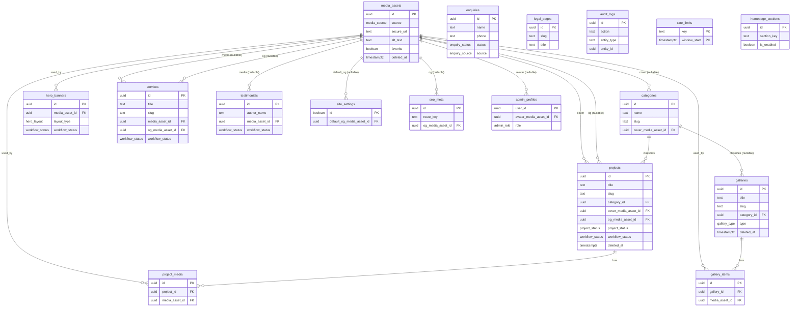

# Database ER Diagram

> **Status:** This diagram reflects the schema **written and self-reviewed** in
> the Task 7 (`supabase/migrations/0001`–`0004`) and Task 8 (`0005`) sections of
> `docs/superpowers/plans/2026-07-27-phase-0-foundation.md`. Tasks 6–9 are
> **deferred** — the client's hosted Supabase project does not exist yet, so
> these migrations have not been applied to any database and the
> `supabase/migrations/*.sql` files do not exist in this repo yet. This doc will
> be regenerated from the real migration files once Tasks 6–9 resume.

All 17 tables from spec §4, with `media_assets` as the central hub referenced
by nearly every content table (cover images, OG images, avatars, gallery/
project media). Enum types (`media_source`, `workflow_status`,
`project_status`, `hero_layout`, `enquiry_status`, `enquiry_source`,
`gallery_type`, `admin_role`) are noted on the relevant attributes but modeled
as plain types below since Mermaid `erDiagram` has no enum construct.

`auth.users` (Supabase-managed, not one of the 17 app tables) is referenced by
several tables (`media_assets.uploaded_by`/`deleted_by`, `projects.deleted_by`,
`enquiries.assigned_to`, `admin_profiles.user_id`, `audit_logs.actor_user_id`,
`site_settings.updated_by`, `seo_meta.updated_by`, `legal_pages.updated_by`,
`homepage_sections.updated_by`) but is omitted from the diagram to keep it
focused on the app's own schema.

## Notes

- `media_usage` (Task 8) is a **computed view**, not a stored table — it sums
  usage of each `media_assets` row across `project_media`, `gallery_items`,
  `hero_banners`, `projects` (cover/og), `services` (media/og), `testimonials`,
  `categories` (cover), `seo_meta` (og), `site_settings` (default_og), and
  `admin_profiles` (avatar). It is intentionally left off the ER diagram above
  since it has no independent identity or FK of its own.
- `public_projects`, `public_services`, `public_testimonials`,
  `public_site_settings` (Task 8) are `security_invoker` views over their base
  tables (column subsets respecting RLS) — also omitted as they add no new
  entities or relationships.
- Partial-unique indexes on `slug` (`projects`, `services`, `galleries`) are
  scoped to `where deleted_at is null`, enabling slug reuse after a soft
  delete; this is a constraint detail, not a relationship, so it isn't shown
  on the diagram.
- `rate_limits` has a composite primary key `(key, window_start)` and no
  foreign keys to any other table.
