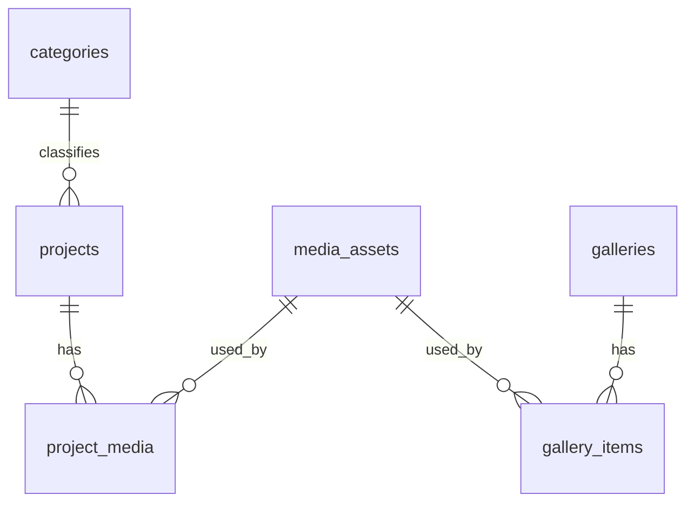

# Phase 0 — Foundation Implementation Plan

> **For agentic workers:** REQUIRED SUB-SKILL: Use superpowers:subagent-driven-development (recommended) or superpowers:executing-plans to implement this plan task-by-task. Steps use checkbox (`- [ ]`) syntax for tracking.

**Goal:** Stand up the 3 Star Decoration codebase foundation — a Next.js App Router app with a fully migrated, RLS-secured Supabase Postgres schema, design tokens, motion providers, a Cloudinary image loader, typed env validation, observability hooks, seed data, CI, and baseline docs — developed directly against one dedicated hosted Supabase project.

**Architecture:** Full-stack Next.js (App Router, TypeScript) in a single repo. Data lives in a hosted Supabase Postgres project (no local Docker stack); the Supabase CLI (`npx supabase`) links to it and pushes migrations directly. All schema, RLS policies, predicate-baked public views, and seed data are versioned SQL migrations. Media is served through Cloudinary via a custom `next/image` loader. Env is validated at boot with zod. Everything ships with tests (Vitest) and a CI gate.

**Workflow note (v1.1):** originally planned around a local Docker-based Supabase stack; changed to a hosted-project-only workflow per explicit direction — this is a single-developer production website, and a dedicated hosted Supabase project from day one keeps iteration simpler than maintaining a local containerized environment. Migrations, RLS, seed, and the RLS test all target the hosted project directly.

**Tech Stack:** Next.js 15 (App Router) · TypeScript · Tailwind CSS v4 · GSAP + Lenis · `@supabase/supabase-js` + `@supabase/ssr` · Supabase CLI (local Postgres) · zod · Vitest + Testing Library · GitHub Actions.

## Global Constraints

- **Spec of record:** `docs/superpowers/specs/2026-07-27-3-star-decoration-design.md` (v1.1). Every table/column/enum in Tasks 7–9 must match spec §4 and §18 exactly.
- **Node:** ≥ 20.19 (local is 20.20). **Package manager:** npm. **No pnpm/yarn.**
- **Supabase is a hosted project from day one — no local Docker stack.** One dedicated Supabase project is created up front (see the Prerequisite section before Task 6); the CLI links to it and pushes migrations directly (`supabase db push`), never `supabase start`/`db reset`. Cloudinary cloud name is a config value only in Phase 0 (real account arrives Phase 3); Vercel is Phase 6.
- **CLI-only credentials are not app env vars.** `SUPABASE_ACCESS_TOKEN`, `SUPABASE_PROJECT_REF`, `SUPABASE_DB_PASSWORD` authenticate the `supabase` CLI for linking/migrations only — `src/lib/env.ts`'s schema never includes them, and they never go in `.env.local`'s app-facing block. Export them in your shell (or a separate untracked file) only for CLI use.
- **A single hosted project doubles as the dev/test target.** Tests that touch the database (Task 8's RLS test) run directly against this one hosted project and must be fully self-cleaning (insert → assert → delete). This is an accepted simplicity tradeoff for a pre-launch, single-developer site; revisit with a properly isolated test project (or Supabase branching) before the site carries real customer data.
- **Supabase CLI is a dev dependency**, invoked as `npx supabase` — never installed globally.
- **Two orthogonal statuses:** `workflow_status` (draft|published|unpublished) ≠ `project_status` (upcoming|ongoing|completed). Never conflate.
- **Soft delete everywhere it applies:** `deleted_at`/`deleted_by` on projects, services, galleries, media_assets, testimonials. Every public read excludes `deleted_at is not null` AND non-published rows.
- **`audit_logs` is insert-only** — no update/delete policy for anyone.
- **TDD:** write the failing test first where a task has testable logic; for scaffold/config tasks the verification command (build/lint/typecheck/`supabase db push`) is the gate.
- **Commit after every task.** Conventional Commit messages. All git commands use `git -C /Users/allwin1906/Documents/GitHub/3stardecoration` OR are run from the repo root (the shell resets cwd between sessions — always cd to the repo first).
- **Repo root:** `/Users/allwin1906/Documents/GitHub/3stardecoration` (contains `.git` + `docs/` already; do not delete `docs/`).

---

## File Structure (created across Phase 0)

```
3stardecoration/
├── src/
│   ├── app/
│   │   ├── layout.tsx                 # root layout, fonts, providers
│   │   ├── page.tsx                   # temporary landing (replaced in Phase 1)
│   │   ├── globals.css                # Tailwind v4 import + @theme design tokens
│   │   └── api/health/route.ts        # health check route handler
│   ├── components/providers/
│   │   └── SmoothScrollProvider.tsx   # Lenis + GSAP wiring, reduced-motion aware
│   ├── hooks/
│   │   └── usePrefersReducedMotion.ts
│   ├── lib/
│   │   ├── env.ts                     # zod-validated environment
│   │   ├── cloudinary-loader.ts       # custom next/image loader
│   │   ├── supabase/
│   │   │   ├── browser.ts             # anon client (browser)
│   │   │   ├── server.ts              # ssr cookie client (RSC/actions)
│   │   │   └── service.ts             # service-role client (privileged, server-only)
│   │   └── observability/
│   │       └── report-error.ts        # reportError() abstraction (Sentry/BetterStack-ready)
│   └── instrumentation.ts             # Next onRequestError -> reportError
├── supabase/
│   ├── config.toml                    # generated by `supabase init`
│   ├── migrations/
│   │   ├── 0001_enums_and_functions.sql
│   │   ├── 0002_media_and_taxonomy.sql
│   │   ├── 0003_content_tables.sql
│   │   ├── 0004_ops_and_settings.sql
│   │   └── 0005_indexes_views_rls.sql
│   └── seed.sql
├── tests/
│   ├── env.test.ts
│   ├── cloudinary-loader.test.ts
│   ├── report-error.test.ts
│   ├── reduced-motion.test.ts
│   └── db/rls.test.ts                 # integration test against local supabase
├── docs/
│   ├── folder-structure.md
│   ├── environment-variables.md
│   └── database-er-diagram.md
├── .github/workflows/ci.yml
├── .env.example
├── next.config.ts
├── tailwind/ (v4 uses CSS @theme; no JS config)
├── vitest.config.ts
├── vitest.setup.ts
└── package.json
```

---

## Task 1: Scaffold Next.js app into the existing repo

**Files:**
- Create: entire Next.js app skeleton at repo root (via `create-next-app` in a temp dir, then moved in)
- Modify: `.gitignore`, `package.json` (scripts)

**Interfaces:**
- Produces: a buildable Next.js app; `npm run dev|build|lint`; import alias `@/*` → `src/*`.

- [ ] **Step 1: Scaffold into a temp dir** (create-next-app refuses a non-empty dir, so build beside the repo then move in)

```bash
cd /Users/allwin1906/Documents/GitHub/3stardecoration
npx create-next-app@latest ../__3star_scaffold --ts --app --tailwind --eslint --src-dir --import-alias "@/*" --use-npm --yes
```

- [ ] **Step 2: Move scaffold into the repo, preserving `.git` and `docs/`**

```bash
cd /Users/allwin1906/Documents/GitHub/3stardecoration
# copy everything except the scaffold's git metadata
rsync -a --exclude='.git' ../__3star_scaffold/ ./
rm -rf ../__3star_scaffold
ls -la   # expect: src/, public/, next.config.ts, package.json, docs/, .git
```

- [ ] **Step 3: Add scripts to `package.json`**

Ensure the `"scripts"` block contains exactly:

```json
"scripts": {
  "dev": "next dev",
  "build": "next build",
  "start": "next start",
  "lint": "next lint",
  "typecheck": "tsc --noEmit",
  "test": "vitest run",
  "test:watch": "vitest",
  "db:start": "supabase start",
  "db:stop": "supabase stop",
  "db:reset": "supabase db reset",
  "db:diff": "supabase db diff"
}
```

- [ ] **Step 4: Append to `.gitignore`**

```
# local env
.env
.env.local
# supabase
supabase/.branches
supabase/.temp
```

- [ ] **Step 5: Verify build & lint pass**

Run: `cd /Users/allwin1906/Documents/GitHub/3stardecoration && npm run lint && npm run build`
Expected: lint passes; build completes with a static `/` route.

- [ ] **Step 6: Commit**

```bash
cd /Users/allwin1906/Documents/GitHub/3stardecoration
git add -A && git commit -m "chore: scaffold Next.js app (App Router, TS, Tailwind v4)"
```

---

## Task 2: Test harness (Vitest + Testing Library)

**Files:**
- Create: `vitest.config.ts`, `vitest.setup.ts`, `tests/smoke.test.ts`
- Modify: `package.json` (devDependencies via install)

**Interfaces:**
- Produces: `npm test` runs Vitest with jsdom + `@testing-library/jest-dom` matchers; `@/*` alias resolves in tests.

- [ ] **Step 1: Install test deps**

```bash
cd /Users/allwin1906/Documents/GitHub/3stardecoration
npm i -D vitest @vitejs/plugin-react jsdom @testing-library/react @testing-library/jest-dom @testing-library/user-event vite-tsconfig-paths
```

- [ ] **Step 2: Write `vitest.config.ts`**

```ts
import { defineConfig } from "vitest/config";
import react from "@vitejs/plugin-react";
import tsconfigPaths from "vite-tsconfig-paths";

export default defineConfig({
  plugins: [react(), tsconfigPaths()],
  test: {
    environment: "jsdom",
    globals: true,
    setupFiles: ["./vitest.setup.ts"],
    include: ["tests/**/*.test.ts", "tests/**/*.test.tsx"],
  },
});
```

- [ ] **Step 3: Write `vitest.setup.ts`**

```ts
import "@testing-library/jest-dom/vitest";
```

- [ ] **Step 4: Write the smoke test `tests/smoke.test.ts`**

```ts
import { describe, it, expect } from "vitest";

describe("test harness", () => {
  it("runs", () => {
    expect(1 + 1).toBe(2);
  });
});
```

- [ ] **Step 5: Run tests — expect PASS**

Run: `cd /Users/allwin1906/Documents/GitHub/3stardecoration && npm test`
Expected: 1 passed.

- [ ] **Step 6: Commit**

```bash
cd /Users/allwin1906/Documents/GitHub/3stardecoration
git add -A && git commit -m "test: add Vitest + Testing Library harness"
```

---

## Task 3: Typed environment validation

**Files:**
- Create: `src/lib/env.ts`, `.env.example`, `tests/env.test.ts`

**Interfaces:**
- Produces: `env` object with typed keys; `parseEnv(raw): Env` that throws on invalid input.
  - Exported names: `parseEnv(raw: Record<string,string|undefined>): Env`, and `env: Env`.
  - `Env` fields: `NEXT_PUBLIC_SUPABASE_URL: string(url)`, `NEXT_PUBLIC_SUPABASE_ANON_KEY: string`, `SUPABASE_SERVICE_ROLE_KEY: string`, `NEXT_PUBLIC_CLOUDINARY_CLOUD_NAME: string`, `CLOUDINARY_API_KEY: string`, `CLOUDINARY_API_SECRET: string`, `NEXT_PUBLIC_SITE_URL: string(url)`, `NEXT_PUBLIC_GA4_MEASUREMENT_ID?: string`.

- [ ] **Step 1: Install zod**

```bash
cd /Users/allwin1906/Documents/GitHub/3stardecoration && npm i zod
```

- [ ] **Step 2: Write the failing test `tests/env.test.ts`**

```ts
import { describe, it, expect } from "vitest";
import { parseEnv } from "@/lib/env";

const valid = {
  NEXT_PUBLIC_SUPABASE_URL: "http://127.0.0.1:54321",
  NEXT_PUBLIC_SUPABASE_ANON_KEY: "anon",
  SUPABASE_SERVICE_ROLE_KEY: "service",
  NEXT_PUBLIC_CLOUDINARY_CLOUD_NAME: "demo",
  CLOUDINARY_API_KEY: "key",
  CLOUDINARY_API_SECRET: "secret",
  NEXT_PUBLIC_SITE_URL: "http://localhost:3000",
};

describe("parseEnv", () => {
  it("parses a valid environment", () => {
    expect(parseEnv(valid).NEXT_PUBLIC_CLOUDINARY_CLOUD_NAME).toBe("demo");
  });
  it("throws when a required var is missing", () => {
    const { CLOUDINARY_API_SECRET, ...missing } = valid;
    expect(() => parseEnv(missing)).toThrow(/CLOUDINARY_API_SECRET/);
  });
  it("throws when a URL is malformed", () => {
    expect(() => parseEnv({ ...valid, NEXT_PUBLIC_SITE_URL: "not-a-url" })).toThrow();
  });
});
```

- [ ] **Step 3: Run — expect FAIL** (`Cannot find module '@/lib/env'`)

Run: `cd /Users/allwin1906/Documents/GitHub/3stardecoration && npx vitest run tests/env.test.ts`

- [ ] **Step 4: Implement `src/lib/env.ts`**

```ts
import { z } from "zod";

const schema = z.object({
  NEXT_PUBLIC_SUPABASE_URL: z.string().url(),
  NEXT_PUBLIC_SUPABASE_ANON_KEY: z.string().min(1),
  SUPABASE_SERVICE_ROLE_KEY: z.string().min(1),
  NEXT_PUBLIC_CLOUDINARY_CLOUD_NAME: z.string().min(1),
  CLOUDINARY_API_KEY: z.string().min(1),
  CLOUDINARY_API_SECRET: z.string().min(1),
  NEXT_PUBLIC_SITE_URL: z.string().url(),
  NEXT_PUBLIC_GA4_MEASUREMENT_ID: z.string().optional(),
});

export type Env = z.infer<typeof schema>;

export function parseEnv(raw: Record<string, string | undefined>): Env {
  const result = schema.safeParse(raw);
  if (!result.success) {
    const issues = result.error.issues.map((i) => `${i.path.join(".")}: ${i.message}`).join("; ");
    throw new Error(`Invalid environment: ${issues}`);
  }
  return result.data;
}

export const env: Env = parseEnv(process.env);
```

- [ ] **Step 5: Run — expect PASS**

Run: `cd /Users/allwin1906/Documents/GitHub/3stardecoration && npx vitest run tests/env.test.ts`

- [ ] **Step 6: Write `.env.example`**

```bash
# Supabase (local defaults from `npx supabase start`)
NEXT_PUBLIC_SUPABASE_URL=http://127.0.0.1:54321
NEXT_PUBLIC_SUPABASE_ANON_KEY=<from `npx supabase start` output>
SUPABASE_SERVICE_ROLE_KEY=<from `npx supabase start` output>

# Cloudinary (cloud name is enough to build the image loader; keys needed in Phase 3)
NEXT_PUBLIC_CLOUDINARY_CLOUD_NAME=demo
CLOUDINARY_API_KEY=changeme
CLOUDINARY_API_SECRET=changeme

# Site
NEXT_PUBLIC_SITE_URL=http://localhost:3000
NEXT_PUBLIC_GA4_MEASUREMENT_ID=
```

- [ ] **Step 7: Commit**

```bash
cd /Users/allwin1906/Documents/GitHub/3stardecoration
git add -A && git commit -m "feat: typed env validation with zod"
```

---

## Task 4: Design tokens, fonts & Tailwind theme

**Files:**
- Modify: `src/app/globals.css`, `src/app/layout.tsx`
- Create: `src/lib/tokens.ts`, `tests/tokens.test.ts`

**Interfaces:**
- Produces: CSS custom properties + Tailwind v4 `@theme` tokens; `tokens` TS mirror for use in JS/GSAP. Font CSS vars `--font-display` (Fraunces) and `--font-sans` (Geist).

> Palette note: `--color-accent` is a champagne-gold placeholder to be confirmed against the real logo (spec §15). Swapping the hex later is a one-line change; do not block on it.

- [ ] **Step 1: Write the failing test `tests/tokens.test.ts`**

```ts
import { describe, it, expect } from "vitest";
import { tokens } from "@/lib/tokens";

describe("design tokens", () => {
  it("exposes core brand colors", () => {
    expect(tokens.color.ivory).toMatch(/^#/);
    expect(tokens.color.charcoal).toMatch(/^#/);
    expect(tokens.color.accent).toMatch(/^#/);
  });
});
```

- [ ] **Step 2: Run — expect FAIL**

Run: `cd /Users/allwin1906/Documents/GitHub/3stardecoration && npx vitest run tests/tokens.test.ts`

- [ ] **Step 3: Create `src/lib/tokens.ts`**

```ts
export const tokens = {
  color: {
    ivory: "#f7f4ef",
    charcoal: "#14110f",
    accent: "#b08d57", // champagne gold — confirm vs. real logo (spec §15)
  },
  ease: {
    // shared GSAP/CSS easing
    lux: [0.16, 1, 0.3, 1] as const,
  },
} as const;
```

- [ ] **Step 4: Replace `src/app/globals.css`**

```css
@import "tailwindcss";

@theme {
  --color-ivory: #f7f4ef;
  --color-charcoal: #14110f;
  --color-accent: #b08d57;

  --spacing-section: 8rem;
}

:root {
  color-scheme: light;
}

html {
  -webkit-font-smoothing: antialiased;
  text-rendering: optimizeLegibility;
}

body {
  background: var(--color-ivory);
  color: var(--color-charcoal);
  font-family: var(--font-sans), system-ui, sans-serif;
}

@media (prefers-reduced-motion: reduce) {
  *,
  *::before,
  *::after {
    animation-duration: 0.001ms !important;
    animation-iteration-count: 1 !important;
    transition-duration: 0.001ms !important;
    scroll-behavior: auto !important;
  }
}
```

- [ ] **Step 5: Wire fonts in `src/app/layout.tsx`** (replace the font setup block)

```tsx
import type { Metadata } from "next";
import { Fraunces, Inter } from "next/font/google";
import "./globals.css";

const fraunces = Fraunces({ subsets: ["latin"], variable: "--font-display", display: "swap" });
const inter = Inter({ subsets: ["latin"], variable: "--font-sans", display: "swap" });

export const metadata: Metadata = {
  title: "3 Star Decoration",
  description: "Premium event decoration — weddings, receptions, and celebrations.",
};

export default function RootLayout({ children }: { children: React.ReactNode }) {
  return (
    <html lang="en" className={`${fraunces.variable} ${inter.variable}`}>
      <body>{children}</body>
    </html>
  );
}
```

> Fonts come from `next/font/google` (no extra dependency). Their `variable` names (`--font-display`, `--font-sans`) are the CSS vars consumed in `globals.css` and `page.tsx`.

- [ ] **Step 6: Run token test + build**

Run: `cd /Users/allwin1906/Documents/GitHub/3stardecoration && npx vitest run tests/tokens.test.ts && npm run build`
Expected: token test PASS; build succeeds.

- [ ] **Step 7: Commit**

```bash
cd /Users/allwin1906/Documents/GitHub/3stardecoration
git add -A && git commit -m "feat: design tokens, fonts, and Tailwind theme"
```

---

## Task 5: Smooth scroll + motion provider

**Files:**
- Create: `src/hooks/usePrefersReducedMotion.ts`, `src/components/providers/SmoothScrollProvider.tsx`, `tests/reduced-motion.test.ts`
- Modify: `src/app/layout.tsx`

**Interfaces:**
- Consumes: nothing.
- Produces: `usePrefersReducedMotion(): boolean`; `<SmoothScrollProvider>` client component that starts Lenis + registers GSAP ScrollTrigger, disabled when reduced motion is preferred.

- [ ] **Step 1: Install motion libs**

```bash
cd /Users/allwin1906/Documents/GitHub/3stardecoration && npm i gsap lenis
```

- [ ] **Step 2: Write the failing test `tests/reduced-motion.test.ts`**

```ts
import { describe, it, expect, vi } from "vitest";
import { renderHook } from "@testing-library/react";
import { usePrefersReducedMotion } from "@/hooks/usePrefersReducedMotion";

function mockMatchMedia(matches: boolean) {
  vi.stubGlobal("matchMedia", (query: string) => ({
    matches,
    media: query,
    addEventListener: () => {},
    removeEventListener: () => {},
    addListener: () => {},
    removeListener: () => {},
    onchange: null,
    dispatchEvent: () => false,
  }));
}

describe("usePrefersReducedMotion", () => {
  it("returns true when the user prefers reduced motion", () => {
    mockMatchMedia(true);
    const { result } = renderHook(() => usePrefersReducedMotion());
    expect(result.current).toBe(true);
  });
  it("returns false otherwise", () => {
    mockMatchMedia(false);
    const { result } = renderHook(() => usePrefersReducedMotion());
    expect(result.current).toBe(false);
  });
});
```

- [ ] **Step 3: Run — expect FAIL**

Run: `cd /Users/allwin1906/Documents/GitHub/3stardecoration && npx vitest run tests/reduced-motion.test.ts`

- [ ] **Step 4: Implement `src/hooks/usePrefersReducedMotion.ts`**

```ts
"use client";
import { useEffect, useState } from "react";

const QUERY = "(prefers-reduced-motion: reduce)";

export function usePrefersReducedMotion(): boolean {
  const [reduced, setReduced] = useState(false);
  useEffect(() => {
    const mql = window.matchMedia(QUERY);
    setReduced(mql.matches);
    const handler = (e: MediaQueryListEvent) => setReduced(e.matches);
    mql.addEventListener("change", handler);
    return () => mql.removeEventListener("change", handler);
  }, []);
  return reduced;
}
```

- [ ] **Step 5: Run — expect PASS**

Run: `cd /Users/allwin1906/Documents/GitHub/3stardecoration && npx vitest run tests/reduced-motion.test.ts`

- [ ] **Step 6: Implement `src/components/providers/SmoothScrollProvider.tsx`**

```tsx
"use client";
import { useEffect } from "react";
import Lenis from "lenis";
import { gsap } from "gsap";
import { ScrollTrigger } from "gsap/ScrollTrigger";
import { usePrefersReducedMotion } from "@/hooks/usePrefersReducedMotion";

export function SmoothScrollProvider({ children }: { children: React.ReactNode }) {
  const reduced = usePrefersReducedMotion();
  useEffect(() => {
    if (reduced) return;
    gsap.registerPlugin(ScrollTrigger);
    const lenis = new Lenis({ lerp: 0.1, smoothWheel: true });
    lenis.on("scroll", ScrollTrigger.update);
    const onRaf = (time: number) => lenis.raf(time * 1000);
    gsap.ticker.add(onRaf);
    gsap.ticker.lagSmoothing(0);
    return () => {
      gsap.ticker.remove(onRaf);
      lenis.destroy();
    };
  }, [reduced]);
  return <>{children}</>;
}
```

- [ ] **Step 7: Wrap children in `src/app/layout.tsx`** (change `<body>{children}</body>` to)

```tsx
<body>
  <SmoothScrollProvider>{children}</SmoothScrollProvider>
</body>
```

Add the import at top: `import { SmoothScrollProvider } from "@/components/providers/SmoothScrollProvider";`

- [ ] **Step 8: Build + test**

Run: `cd /Users/allwin1906/Documents/GitHub/3stardecoration && npm test && npm run build`
Expected: all tests pass; build succeeds.

- [ ] **Step 9: Commit**

```bash
cd /Users/allwin1906/Documents/GitHub/3stardecoration
git add -A && git commit -m "feat: Lenis smooth scroll + GSAP provider (reduced-motion aware)"
```

---

## Prerequisite (before Task 6): create the hosted Supabase project

**This is the one step only you can do** — it requires your Supabase account and cannot be automated by an agent (no browser OAuth in this environment).

1. Go to [supabase.com](https://supabase.com/dashboard) → **New Project**. Name it e.g. `3star-decoration`, pick a region close to your users, and set a **database password** (save it — you'll need it below).
2. Once the project is provisioned, go to **Project Settings → API** and note:
   - **Project URL** (`https://<ref>.supabase.co`)
   - **anon public key**
   - **service_role key** (secret)
3. Go to **Project Settings → General** and note the **Reference ID** (the `<ref>` in the URL above).
4. Go to your **account** (not project) → **Access Tokens** → generate a **Personal Access Token** (needed so the CLI can link/push without an interactive browser login).

Hand back (or place directly into the files named below, if you'd rather not paste the service role key/token into chat):
- `SUPABASE_PROJECT_REF` — the reference ID
- `NEXT_PUBLIC_SUPABASE_URL`, `NEXT_PUBLIC_SUPABASE_ANON_KEY`, `SUPABASE_SERVICE_ROLE_KEY` — for `.env.local` (app runtime, validated by `src/lib/env.ts`)
- `SUPABASE_ACCESS_TOKEN` — the personal access token (CLI auth only, not an app env var)
- `SUPABASE_DB_PASSWORD` — the database password you set in step 1 (CLI auth only, not an app env var)

---

## Task 6: Supabase hosted project link + typed clients

**Files:**
- Create: `supabase/` (via `supabase init`), `src/lib/supabase/browser.ts`, `src/lib/supabase/server.ts`, `src/lib/supabase/service.ts`
- Modify: `package.json` (`db:*` scripts, updated for the hosted workflow)

**Interfaces:**
- Produces: `createBrowserClient()`, `createServerClient()` (async, cookie-aware), `createServiceClient()` (server-only).

> Prerequisite: the hosted Supabase project above must already exist, with `SUPABASE_PROJECT_REF`, `SUPABASE_ACCESS_TOKEN`, and `SUPABASE_DB_PASSWORD` available in your shell environment (exported, or in a separate untracked file you `source`) — never committed. No Docker required for this task or any later one.

- [ ] **Step 1: Install Supabase deps (CLI as dev dep)**

```bash
cd /Users/allwin1906/Documents/GitHub/3stardecoration
npm i @supabase/supabase-js @supabase/ssr
npm i -D supabase
```

- [ ] **Step 2: Initialize the local Supabase config (no Docker involved — this just scaffolds `supabase/`)**

```bash
cd /Users/allwin1906/Documents/GitHub/3stardecoration
npx supabase init   # answer "N" to generating VS Code settings if prompted
```

- [ ] **Step 3: Link to the hosted project (non-interactive)**

```bash
cd /Users/allwin1906/Documents/GitHub/3stardecoration
SUPABASE_ACCESS_TOKEN="$SUPABASE_ACCESS_TOKEN" npx supabase link \
  --project-ref "$SUPABASE_PROJECT_REF" \
  --password "$SUPABASE_DB_PASSWORD"
```

Expected: "Finished supabase link.". This writes the linked project ref into `supabase/.temp/` (gitignored — already covered by Task 1's `.gitignore` additions).

- [ ] **Step 4: Populate `.env.local` from the hosted project's Settings → API values**

```bash
cd /Users/allwin1906/Documents/GitHub/3stardecoration
cp .env.example .env.local
```

Edit `.env.local` and fill in `NEXT_PUBLIC_SUPABASE_URL`, `NEXT_PUBLIC_SUPABASE_ANON_KEY`, `SUPABASE_SERVICE_ROLE_KEY` with the real values from the Prerequisite step. Leave the Cloudinary values as placeholders (Phase 3). `SUPABASE_ACCESS_TOKEN`/`SUPABASE_DB_PASSWORD` do **not** go in this file — they're CLI-only (see Global Constraints).

Also update `.env.example`'s stale comment (written in Task 3, before this workflow changed) from `# Supabase (local defaults from \`npx supabase start\`)` to `# Supabase (hosted project — see Project Settings → API in the dashboard)`, and change the three example values below it from `http://127.0.0.1:54321` / `<from \`npx supabase start\` output>` to generic hosted-style placeholders (e.g. `https://<ref>.supabase.co` and `<from Project Settings → API>`).

- [ ] **Step 5: Update `package.json`'s `db:*` scripts for the hosted workflow** (replace the four `db:*` lines Task 1 added)

```json
"db:link": "supabase link",
"db:push": "supabase db push --yes",
"db:diff": "supabase db diff",
"db:seed": "psql \"$SUPABASE_DB_URL\" -f supabase/seed.sql"
```

> `db:start`/`db:stop`/`db:reset` are removed — there is no local stack to start/stop/reset. `db:seed` expects a `SUPABASE_DB_URL` env var (the hosted project's direct Postgres connection string, from Settings → Database → Connection string, URI format, port 5432) exported in your shell — not committed, not in `.env.local`.

- [ ] **Step 6: Implement `src/lib/supabase/browser.ts`**

```ts
import { createBrowserClient as _create } from "@supabase/ssr";
import { env } from "@/lib/env";

export function createBrowserClient() {
  return _create(env.NEXT_PUBLIC_SUPABASE_URL, env.NEXT_PUBLIC_SUPABASE_ANON_KEY);
}
```

- [ ] **Step 7: Implement `src/lib/supabase/server.ts`**

```ts
import { createServerClient as _create } from "@supabase/ssr";
import { cookies } from "next/headers";
import { env } from "@/lib/env";

export async function createServerClient() {
  const cookieStore = await cookies();
  return _create(env.NEXT_PUBLIC_SUPABASE_URL, env.NEXT_PUBLIC_SUPABASE_ANON_KEY, {
    cookies: {
      getAll: () => cookieStore.getAll(),
      setAll: (toSet) => {
        try {
          toSet.forEach(({ name, value, options }) => cookieStore.set(name, value, options));
        } catch {
          // called from a Server Component — safe to ignore; middleware refreshes sessions
        }
      },
    },
  });
}
```

- [ ] **Step 8: Implement `src/lib/supabase/service.ts`**

```ts
import "server-only";
import { createClient } from "@supabase/supabase-js";
import { env } from "@/lib/env";

export function createServiceClient() {
  return createClient(env.NEXT_PUBLIC_SUPABASE_URL, env.SUPABASE_SERVICE_ROLE_KEY, {
    auth: { persistSession: false, autoRefreshToken: false },
  });
}
```

```bash
cd /Users/allwin1906/Documents/GitHub/3stardecoration && npm i server-only
```

- [ ] **Step 9: Typecheck + commit**

Run: `cd /Users/allwin1906/Documents/GitHub/3stardecoration && npm run typecheck`

```bash
git add -A && git commit -m "feat: link hosted Supabase project + typed browser/server/service clients"
```

---

## Task 7: Database schema migrations

**Files:**
- Create: `supabase/migrations/0001_enums_and_functions.sql`, `0002_media_and_taxonomy.sql`, `0003_content_tables.sql`, `0004_ops_and_settings.sql`

**Interfaces:**
- Produces: all tables/enums/functions from spec §4 + §18. Consumed by Task 8 (indexes/views/RLS) and Task 9 (seed).

- [ ] **Step 1: Write `0001_enums_and_functions.sql`**

```sql
create type media_source as enum ('cloudinary_image','cloudinary_video','youtube','vimeo');
create type workflow_status as enum ('draft','published','unpublished');
create type project_status as enum ('upcoming','ongoing','completed');
create type hero_layout as enum ('fullscreen_video','fullscreen_image','split','carousel');
create type enquiry_status as enum ('new','contacted','closed');
create type enquiry_source as enum ('quote_form','contact_form');
create type gallery_type as enum ('standard','homepage_featured','instagram');
create type admin_role as enum ('owner','admin');

create or replace function set_updated_at() returns trigger
language plpgsql as $$
begin new.updated_at = now(); return new; end;
$$;
-- NOTE: is_admin() is defined in 0005, after admin_profiles exists. Postgres validates
-- function bodies at creation time, so it cannot reference a table that does not yet exist.
```

- [ ] **Step 2: Write `0002_media_and_taxonomy.sql`**

```sql
create table media_assets (
  id uuid primary key default gen_random_uuid(),
  source media_source not null,
  public_id text,
  provider_id text,
  secure_url text not null,
  thumbnail_url text,
  width int, height int, duration int,
  format text,
  file_size bigint,
  alt_text text,
  title text,
  caption text,
  tags text[] not null default '{}',
  dominant_color text,
  blur_placeholder text,
  favorite boolean not null default false,
  uploaded_by uuid references auth.users(id),
  uploaded_at timestamptz not null default now(),
  created_at timestamptz not null default now(),
  updated_at timestamptz not null default now(),
  deleted_at timestamptz,
  deleted_by uuid references auth.users(id)
);
create trigger media_assets_updated before update on media_assets
  for each row execute function set_updated_at();

create table categories (
  id uuid primary key default gen_random_uuid(),
  name text not null,
  slug text not null,
  description text,
  sort_order int not null default 0,
  cover_media_asset_id uuid references media_assets(id) on delete set null,
  created_at timestamptz not null default now(),
  updated_at timestamptz not null default now()
);
create unique index categories_slug_key on categories(slug);
create trigger categories_updated before update on categories
  for each row execute function set_updated_at();
```

- [ ] **Step 3: Write `0003_content_tables.sql`**

```sql
create table hero_banners (
  id uuid primary key default gen_random_uuid(),
  media_asset_id uuid references media_assets(id) on delete restrict,
  eyebrow text, title text, subtitle text,
  cta_label text, cta_href text,
  layout_type hero_layout not null default 'fullscreen_image',
  sort_order int not null default 0,
  workflow_status workflow_status not null default 'draft',
  published_at timestamptz,
  created_at timestamptz not null default now(),
  updated_at timestamptz not null default now()
);
create trigger hero_banners_updated before update on hero_banners
  for each row execute function set_updated_at();

create table projects (
  id uuid primary key default gen_random_uuid(),
  title text not null,
  slug text not null,
  category_id uuid references categories(id) on delete restrict,
  event_type text,
  summary text,
  description text,
  cover_media_asset_id uuid references media_assets(id) on delete restrict,
  client_name text,
  location text,
  event_date date,
  completion_date date,
  project_status project_status not null default 'completed',
  featured_on_homepage boolean not null default false,
  sort_order int not null default 0,
  workflow_status workflow_status not null default 'draft',
  published_at timestamptz,
  meta_title text,
  meta_description text,
  og_media_asset_id uuid references media_assets(id) on delete set null,
  auto_seo_generated boolean not null default false,
  robots_index boolean not null default true,
  robots_follow boolean not null default true,
  created_at timestamptz not null default now(),
  updated_at timestamptz not null default now(),
  deleted_at timestamptz,
  deleted_by uuid references auth.users(id)
);
create trigger projects_updated before update on projects
  for each row execute function set_updated_at();

create table project_media (
  id uuid primary key default gen_random_uuid(),
  project_id uuid not null references projects(id) on delete cascade,
  media_asset_id uuid not null references media_assets(id) on delete restrict,
  caption text,
  sort_order int not null default 0,
  created_at timestamptz not null default now()
);

create table galleries (
  id uuid primary key default gen_random_uuid(),
  title text not null,
  slug text not null,
  description text,
  category_id uuid references categories(id) on delete set null,
  type gallery_type not null default 'standard',
  is_active boolean not null default false,
  sort_order int not null default 0,
  created_at timestamptz not null default now(),
  updated_at timestamptz not null default now(),
  deleted_at timestamptz,
  deleted_by uuid references auth.users(id)
);
create trigger galleries_updated before update on galleries
  for each row execute function set_updated_at();

create table gallery_items (
  id uuid primary key default gen_random_uuid(),
  gallery_id uuid not null references galleries(id) on delete cascade,
  media_asset_id uuid not null references media_assets(id) on delete restrict,
  caption text,
  sort_order int not null default 0,
  created_at timestamptz not null default now()
);

create table services (
  id uuid primary key default gen_random_uuid(),
  title text not null,
  slug text not null,
  short_description text,
  description text,
  icon text,
  media_asset_id uuid references media_assets(id) on delete set null,
  sort_order int not null default 0,
  workflow_status workflow_status not null default 'draft',
  published_at timestamptz,
  meta_title text,
  meta_description text,
  og_media_asset_id uuid references media_assets(id) on delete set null,
  robots_index boolean not null default true,
  robots_follow boolean not null default true,
  created_at timestamptz not null default now(),
  updated_at timestamptz not null default now(),
  deleted_at timestamptz,
  deleted_by uuid references auth.users(id)
);
create trigger services_updated before update on services
  for each row execute function set_updated_at();

create table testimonials (
  id uuid primary key default gen_random_uuid(),
  author_name text not null,
  event_type text,
  quote text not null,
  rating int check (rating between 1 and 5),
  media_asset_id uuid references media_assets(id) on delete set null,
  sort_order int not null default 0,
  workflow_status workflow_status not null default 'draft',
  published_at timestamptz,
  created_at timestamptz not null default now(),
  updated_at timestamptz not null default now(),
  deleted_at timestamptz,
  deleted_by uuid references auth.users(id)
);
create trigger testimonials_updated before update on testimonials
  for each row execute function set_updated_at();
```

- [ ] **Step 4: Write `0004_ops_and_settings.sql`**

```sql
create table enquiries (
  id uuid primary key default gen_random_uuid(),
  name text not null,
  phone text not null,
  email text,
  event_type text,
  event_date date,
  event_city text,
  venue text,
  guest_count int,
  budget_range text,
  preferred_contact_time text,
  message text,
  status enquiry_status not null default 'new',
  assigned_to uuid references auth.users(id),
  notes text,
  source enquiry_source not null default 'quote_form',
  ip text,
  user_agent text,
  created_at timestamptz not null default now(),
  updated_at timestamptz not null default now()
);
create trigger enquiries_updated before update on enquiries
  for each row execute function set_updated_at();

create table site_settings (
  id boolean primary key default true,
  business_phone text,
  whatsapp_number text,
  whatsapp_message_template text,
  business_email text,
  address text,
  google_map_embed text,
  social_links jsonb not null default '{}',
  homepage_content jsonb not null default '{}',
  ga4_measurement_id text,
  gsc_verification_token text,
  canonical_base_url text,
  site_name text,
  default_meta_title text,
  default_meta_description text,
  default_og_media_asset_id uuid references media_assets(id) on delete set null,
  watermark_config jsonb,
  updated_at timestamptz not null default now(),
  updated_by uuid references auth.users(id),
  constraint site_settings_singleton check (id = true)
);
create trigger site_settings_updated before update on site_settings
  for each row execute function set_updated_at();

create table seo_meta (
  id uuid primary key default gen_random_uuid(),
  route_key text not null unique,
  meta_title text,
  meta_description text,
  og_media_asset_id uuid references media_assets(id) on delete set null,
  canonical text,
  robots_index boolean not null default true,
  robots_follow boolean not null default true,
  updated_at timestamptz not null default now(),
  updated_by uuid references auth.users(id)
);
create trigger seo_meta_updated before update on seo_meta
  for each row execute function set_updated_at();

create table legal_pages (
  id uuid primary key default gen_random_uuid(),
  slug text not null unique,
  title text not null,
  body text,
  updated_at timestamptz not null default now(),
  updated_by uuid references auth.users(id)
);
create trigger legal_pages_updated before update on legal_pages
  for each row execute function set_updated_at();

create table admin_profiles (
  user_id uuid primary key references auth.users(id) on delete cascade,
  full_name text,
  avatar_media_asset_id uuid references media_assets(id) on delete set null,
  role admin_role not null default 'admin',
  created_at timestamptz not null default now(),
  updated_at timestamptz not null default now()
);
create trigger admin_profiles_updated before update on admin_profiles
  for each row execute function set_updated_at();

create table audit_logs (
  id uuid primary key default gen_random_uuid(),
  actor_user_id uuid references auth.users(id),
  action text not null,
  entity_type text not null,
  entity_id uuid,
  diff jsonb,
  ip text,
  user_agent text,
  created_at timestamptz not null default now()
);

create table rate_limits (
  key text not null,
  window_start timestamptz not null,
  count int not null default 0,
  primary key (key, window_start)
);

create table homepage_sections (
  id uuid primary key default gen_random_uuid(),
  section_key text not null unique,
  is_enabled boolean not null default true,
  sort_order int not null default 0,
  is_featured boolean not null default false,
  config jsonb not null default '{}',
  updated_at timestamptz not null default now(),
  updated_by uuid references auth.users(id)
);
create trigger homepage_sections_updated before update on homepage_sections
  for each row execute function set_updated_at();
```

- [ ] **Step 5: Apply migrations to the hosted project (fails loudly on any SQL error)**

Run: `cd /Users/allwin1906/Documents/GitHub/3stardecoration && npx supabase db push --yes`
Expected: "Applying migration ..." for 0001–0004 with no errors. (Requires the project already linked via Task 6, Step 3.)

- [ ] **Step 6: Commit**

```bash
cd /Users/allwin1906/Documents/GitHub/3stardecoration
git add -A && git commit -m "feat(db): core schema — enums, media, content, ops & settings tables"
```

---

## Task 8: Indexes, public views, usage view & RLS

**Files:**
- Create: `supabase/migrations/0005_indexes_views_rls.sql`
- Create: `tests/db/rls.test.ts`

**Interfaces:**
- Consumes: all tables from Task 7.
- Produces: partial-unique slug indexes; `media_usage` view (`media_asset_id`, `usage_count`); `public_*` views; RLS policies. Consumed by Task 9 (seed) and the public site (Phase 1+).

- [ ] **Step 1: Write `0005_indexes_views_rls.sql`**

```sql
-- Admin predicate — defined here now that admin_profiles (0004) exists. SECURITY DEFINER so it
-- reads admin_profiles with owner rights, preventing RLS recursion on admin_profiles' own policy.
create or replace function is_admin() returns boolean
language sql stable security definer set search_path = public as $$
  select exists (select 1 from admin_profiles where user_id = auth.uid());
$$;

-- Partial unique slugs (Recycle-Bin safe): a trashed row frees its slug
create unique index projects_slug_active_key on projects(slug) where deleted_at is null;
create unique index services_slug_active_key on services(slug) where deleted_at is null;
create unique index galleries_slug_active_key on galleries(slug) where deleted_at is null;

-- usage_count as a computed view (never a stored column)
create view media_usage as
select m.id as media_asset_id,
  (select count(*) from project_media pm where pm.media_asset_id = m.id)
  + (select count(*) from gallery_items gi where gi.media_asset_id = m.id)
  + (select count(*) from hero_banners hb where hb.media_asset_id = m.id)
  + (select count(*) from projects p where p.cover_media_asset_id = m.id or p.og_media_asset_id = m.id)
  + (select count(*) from services s where s.media_asset_id = m.id or s.og_media_asset_id = m.id)
  + (select count(*) from testimonials t where t.media_asset_id = m.id)
  + (select count(*) from categories c where c.cover_media_asset_id = m.id)
  + (select count(*) from seo_meta se where se.og_media_asset_id = m.id)
  + (select count(*) from site_settings ss where ss.default_og_media_asset_id = m.id)
  + (select count(*) from admin_profiles ap where ap.avatar_media_asset_id = m.id)
  as usage_count
from media_assets m;

-- Enable RLS on every table
alter table media_assets enable row level security;
alter table categories enable row level security;
alter table hero_banners enable row level security;
alter table projects enable row level security;
alter table project_media enable row level security;
alter table galleries enable row level security;
alter table gallery_items enable row level security;
alter table services enable row level security;
alter table testimonials enable row level security;
alter table enquiries enable row level security;
alter table site_settings enable row level security;
alter table seo_meta enable row level security;
alter table legal_pages enable row level security;
alter table admin_profiles enable row level security;
alter table audit_logs enable row level security;
alter table rate_limits enable row level security;
alter table homepage_sections enable row level security;

-- Admin (authenticated + in admin_profiles) has full access on content tables
create policy admin_all on media_assets    for all to authenticated using (is_admin()) with check (is_admin());
create policy admin_all on categories       for all to authenticated using (is_admin()) with check (is_admin());
create policy admin_all on hero_banners     for all to authenticated using (is_admin()) with check (is_admin());
create policy admin_all on projects         for all to authenticated using (is_admin()) with check (is_admin());
create policy admin_all on project_media    for all to authenticated using (is_admin()) with check (is_admin());
create policy admin_all on galleries        for all to authenticated using (is_admin()) with check (is_admin());
create policy admin_all on gallery_items    for all to authenticated using (is_admin()) with check (is_admin());
create policy admin_all on services         for all to authenticated using (is_admin()) with check (is_admin());
create policy admin_all on testimonials     for all to authenticated using (is_admin()) with check (is_admin());
create policy admin_all on enquiries        for all to authenticated using (is_admin()) with check (is_admin());
create policy admin_all on site_settings    for all to authenticated using (is_admin()) with check (is_admin());
create policy admin_all on seo_meta         for all to authenticated using (is_admin()) with check (is_admin());
create policy admin_all on legal_pages      for all to authenticated using (is_admin()) with check (is_admin());
create policy admin_all on admin_profiles   for all to authenticated using (is_admin()) with check (is_admin());
create policy admin_all on homepage_sections for all to authenticated using (is_admin()) with check (is_admin());

-- audit_logs: insert-only, even for admins (no update/delete policy exists)
create policy audit_insert on audit_logs for insert to authenticated with check (is_admin());
create policy audit_read   on audit_logs for select to authenticated using (is_admin());

-- Public (anon) read: only published, non-deleted rows
create policy public_read on projects       for select to anon using (workflow_status = 'published' and deleted_at is null);
create policy public_read on services        for select to anon using (workflow_status = 'published' and deleted_at is null);
create policy public_read on testimonials    for select to anon using (workflow_status = 'published' and deleted_at is null);
create policy public_read on hero_banners    for select to anon using (workflow_status = 'published');
create policy public_read on galleries       for select to anon using (is_active = true and deleted_at is null);
create policy public_read on gallery_items   for select to anon using (
  exists (select 1 from galleries g where g.id = gallery_id and g.is_active and g.deleted_at is null));
create policy public_read on project_media   for select to anon using (
  exists (select 1 from projects p where p.id = project_id and p.workflow_status = 'published' and p.deleted_at is null));
create policy public_read on categories      for select to anon using (true);
create policy public_read on media_assets    for select to anon using (deleted_at is null);
create policy public_read on legal_pages     for select to anon using (true);
create policy public_read on seo_meta        for select to anon using (true);
create policy public_read on site_settings   for select to anon using (true);
create policy public_read on homepage_sections for select to anon using (is_enabled = true);
-- enquiries, audit_logs, rate_limits: NO anon policy (submission & ops go through the service role)

-- Convenience public views (security_invoker: they respect the RLS above)
create view public_projects with (security_invoker = true) as
  select id, title, slug, category_id, event_type, summary, cover_media_asset_id, location,
         event_date, completion_date, project_status, featured_on_homepage, sort_order,
         meta_title, meta_description, og_media_asset_id, robots_index, robots_follow, published_at
  from projects;

create view public_services with (security_invoker = true) as
  select id, title, slug, short_description, description, icon, media_asset_id, sort_order,
         meta_title, meta_description, og_media_asset_id, robots_index, robots_follow
  from services;

create view public_testimonials with (security_invoker = true) as
  select id, author_name, event_type, quote, rating, media_asset_id, sort_order from testimonials;

create view public_site_settings with (security_invoker = true) as
  select business_phone, whatsapp_number, whatsapp_message_template, business_email, address,
         google_map_embed, social_links, homepage_content, ga4_measurement_id,
         gsc_verification_token, canonical_base_url, site_name,
         default_meta_title, default_meta_description, default_og_media_asset_id
  from site_settings;

-- Explicit grants so PostgREST exposes the views to the anon/authenticated roles
grant select on public_projects, public_services, public_testimonials, public_site_settings to anon, authenticated;
grant select on media_usage to authenticated;
```

- [ ] **Step 2: Apply — expect success**

Run: `cd /Users/allwin1906/Documents/GitHub/3stardecoration && npx supabase db push --yes`
Expected: migration 0005 applies to the hosted project with no errors.

- [ ] **Step 3: Write the RLS integration test `tests/db/rls.test.ts`**

```ts
import { describe, it, expect, beforeAll } from "vitest";
import { createClient } from "@supabase/supabase-js";

// These env vars come from the hosted Supabase project's Settings → API page
// (populated into .env.local in Task 6, Step 4). There is no local stack —
// this test runs directly against the hosted project and must be fully
// self-cleaning (see Global Constraints).
const URL = process.env.NEXT_PUBLIC_SUPABASE_URL!;
const ANON = process.env.NEXT_PUBLIC_SUPABASE_ANON_KEY!;
const SERVICE = process.env.SUPABASE_SERVICE_ROLE_KEY!;

const anon = createClient(URL, ANON);
const service = createClient(URL, SERVICE, { auth: { persistSession: false } });

describe("RLS", () => {
  let categoryId: string;
  beforeAll(async () => {
    const { data } = await service.from("categories").select("id").eq("slug", "wedding").single();
    categoryId = data!.id;
  });

  it("anon cannot insert a project", async () => {
    const { error } = await anon.from("projects").insert({ title: "x", slug: "x", category_id: categoryId });
    expect(error).not.toBeNull();
  });

  it("anon sees only published, non-deleted projects via the public view", async () => {
    const { data, error } = await anon.from("public_projects").select("slug");
    expect(error).toBeNull();
    // seed publishes exactly one demo project
    expect(data!.every((r) => typeof r.slug === "string")).toBe(true);
  });

  it("partial-unique slug allows reuse after soft delete", async () => {
    const base = { title: "T", slug: "dup-slug", category_id: categoryId, cover_media_asset_id: null };
    const a = await service.from("projects").insert(base).select("id").single();
    await service.from("projects").update({ deleted_at: new Date().toISOString() }).eq("id", a.data!.id);
    const b = await service.from("projects").insert(base).select("id").single();
    expect(b.error).toBeNull();
    // cleanup
    await service.from("projects").delete().eq("id", a.data!.id);
    await service.from("projects").delete().eq("id", b.data!.id);
  });
});
```

> This test requires `.env.local` to be loaded. Add `import "dotenv/config"` support: `npm i -D dotenv` and prepend `import "dotenv/config";` — or run with `node --env-file=.env.local`. In `vitest.config.ts`, add `import "dotenv/config"` at the top so `process.env` is populated from `.env.local` (rename or symlink `.env.local` to `.env`, or set `dotenv` path). Simplest: `npm i -D dotenv` and add `test: { env: loadEnv(...) }` — see Step 4.

- [ ] **Step 4: Wire env into Vitest** (modify `vitest.config.ts`)

```ts
import { defineConfig, loadEnv } from "vitest/config";
import react from "@vitejs/plugin-react";
import tsconfigPaths from "vite-tsconfig-paths";

export default defineConfig(({ mode }) => ({
  plugins: [react(), tsconfigPaths()],
  test: {
    environment: "jsdom",
    globals: true,
    setupFiles: ["./vitest.setup.ts"],
    include: ["tests/**/*.test.ts", "tests/**/*.test.tsx"],
    env: loadEnv(mode, process.cwd(), ""),
  },
}));
```

- [ ] **Step 5: Do not run this test yet** — its `beforeAll` looks up the `wedding` category by slug, which only exists once Task 9's seed data is applied. Proceed to Task 9; its Step 4 runs this test.

- [ ] **Step 6: Commit**

```bash
cd /Users/allwin1906/Documents/GitHub/3stardecoration
git add -A && git commit -m "feat(db): indexes, public views, usage view, and RLS policies"
```

---

## Task 9: Seed data

**Files:**
- Create/replace: `supabase/seed.sql`

**Interfaces:**
- Consumes: schema from Tasks 7–8.
- Produces: 7 categories, default homepage_sections, a site_settings singleton, a demo published project with media (so public views + Phase 1 have data).

- [ ] **Step 1: Write `supabase/seed.sql`** (idempotent — safe to re-run against the single hosted project without duplicating rows, using `on conflict do nothing` and an existence guard for the demo project)

```sql
-- Categories (spec §4.2)
insert into categories (name, slug, sort_order) values
  ('Wedding','wedding',1),
  ('Reception','reception',2),
  ('Engagement','engagement',3),
  ('Birthday','birthday',4),
  ('Baby Shower','baby-shower',5),
  ('Corporate','corporate',6),
  ('Stage','stage',7)
on conflict (slug) do nothing;

-- Homepage builder default sections (spec §4.17)
insert into homepage_sections (section_key, is_enabled, sort_order, is_featured) values
  ('hero', true, 1, false),
  ('featured_works', true, 2, true),
  ('featured_services', true, 3, false),
  ('testimonials', true, 4, false),
  ('instagram', true, 5, false),
  ('quote_cta', true, 6, false)
on conflict (section_key) do nothing;

-- Site settings singleton (real values supplied by the owner later)
insert into site_settings (id, site_name, whatsapp_number, whatsapp_message_template,
                           business_phone, business_email, canonical_base_url,
                           default_meta_title, default_meta_description, social_links)
values (true, '3 Star Decoration', '910000000000',
        'Hi 3 Star Decoration, I''d like a quote. {details}',
        '+91 00000 00000', 'hello@example.com', 'http://localhost:3000',
        '3 Star Decoration — Premium Event Decoration',
        'Weddings, receptions, and celebrations, beautifully designed.',
        '{"instagram":"","facebook":"","youtube":""}')
on conflict (id) do nothing;

-- A demo image asset + published project so public views return data.
-- Guarded as a whole block so re-running this script never creates a second
-- demo media asset once the project (which references it) already exists.
do $$
declare
  demo_media_id uuid;
begin
  if not exists (select 1 from projects where slug = 'ivory-garden-wedding') then
    insert into media_assets (source, secure_url, alt_text, title, width, height)
    values ('cloudinary_image',
            'https://res.cloudinary.com/demo/image/upload/sample.jpg',
            'Elegant wedding stage decoration', 'Demo cover', 1600, 1067)
    returning id into demo_media_id;

    insert into projects (title, slug, category_id, event_type, summary, cover_media_asset_id,
                          project_status, featured_on_homepage, workflow_status, published_at)
    values ('Ivory Garden Wedding', 'ivory-garden-wedding',
            (select id from categories where slug = 'wedding'),
            'Wedding', 'A soft ivory-and-gold garden ceremony.',
            demo_media_id, 'completed', true, 'published', now());
  end if;
end $$;
```

- [ ] **Step 2: Apply the seed to the hosted project via `psql`** (there is no local `db reset` shortcut for a hosted project — `supabase db push` only applies migrations, never `seed.sql`, against a remote project)

Find the connection string in the Supabase dashboard: **Project Settings → Database → Connection string** (URI format, direct connection, port 5432 — not the pooler). Export it, then run:

```bash
cd /Users/allwin1906/Documents/GitHub/3stardecoration
export SUPABASE_DB_URL="postgresql://postgres:<password>@db.<ref>.supabase.co:5432/postgres"
psql "$SUPABASE_DB_URL" -f supabase/seed.sql
```

Expected: no errors. If `psql` is not installed locally, paste `supabase/seed.sql`'s contents into the Supabase dashboard's **SQL Editor** and run it there instead.

- [ ] **Step 3: Verify seed via anon view**

Run:
```bash
cd /Users/allwin1906/Documents/GitHub/3stardecoration
psql "$SUPABASE_DB_URL" -c "select slug from public_projects;"
# If psql is not installed, run the same query in the Supabase dashboard's SQL Editor instead.
```
Expected: one row, `ivory-garden-wedding`.

- [ ] **Step 4: Run the Task 8 RLS test now that seed exists**

Run: `cd /Users/allwin1906/Documents/GitHub/3stardecoration && npx vitest run tests/db/rls.test.ts`
Expected: 3 passed.

- [ ] **Step 5: Commit**

```bash
cd /Users/allwin1906/Documents/GitHub/3stardecoration
git add -A && git commit -m "feat(db): seed categories, homepage sections, settings, demo project"
```

---

## Task 10: Cloudinary image loader

**Files:**
- Create: `src/lib/cloudinary-loader.ts`, `tests/cloudinary-loader.test.ts`
- Modify: `next.config.ts`

**Interfaces:**
- Produces: default-exported `cloudinaryLoader({ src, width, quality })` returning a transformed URL for Cloudinary public IDs, and a pass-through URL for absolute non-Cloudinary URLs and root-relative local paths (`/...` — `next.config.ts` sets `loader: "custom"` globally, so every `next/image` in the app routes through this loader, including local `/public` assets and mock fixtures used before Cloudinary is wired).

- [ ] **Step 1: Write the failing test `tests/cloudinary-loader.test.ts`**

```ts
import { describe, it, expect, beforeEach, vi } from "vitest";

beforeEach(() => {
  vi.stubEnv("NEXT_PUBLIC_CLOUDINARY_CLOUD_NAME", "threestar");
});

describe("cloudinaryLoader", () => {
  it("builds a transformed delivery URL for a public id", async () => {
    const { default: loader } = await import("@/lib/cloudinary-loader");
    const url = loader({ src: "portfolio/wedding1", width: 800, quality: 70 });
    expect(url).toBe(
      "https://res.cloudinary.com/threestar/image/upload/f_auto,q_70,w_800/portfolio/wedding1"
    );
  });
  it("defaults quality to auto", async () => {
    const { default: loader } = await import("@/lib/cloudinary-loader");
    const url = loader({ src: "portfolio/wedding1", width: 400 });
    expect(url).toContain("q_auto");
  });
  it("passes through absolute non-Cloudinary URLs (e.g. YouTube thumbnails)", async () => {
    const { default: loader } = await import("@/lib/cloudinary-loader");
    const src = "https://i.ytimg.com/vi/abc/hqdefault.jpg";
    expect(loader({ src, width: 400 })).toBe(src);
  });
  it("passes through root-relative local paths (e.g. /public assets, mock fixtures)", async () => {
    const { default: loader } = await import("@/lib/cloudinary-loader");
    const src = "/demo/wedding-1.jpg";
    expect(loader({ src, width: 400 })).toBe(src);
  });
});
```

- [ ] **Step 2: Run — expect FAIL**

Run: `cd /Users/allwin1906/Documents/GitHub/3stardecoration && npx vitest run tests/cloudinary-loader.test.ts`

- [ ] **Step 3: Implement `src/lib/cloudinary-loader.ts`**

```ts
type LoaderArgs = { src: string; width: number; quality?: number };

export default function cloudinaryLoader({ src, width, quality }: LoaderArgs): string {
  // Absolute URLs (already-hosted images, YouTube/Vimeo thumbnails) pass through unchanged.
  if (/^https?:\/\//.test(src)) return src;
  // Root-relative local paths (files under /public, mock fixtures used before
  // Cloudinary is wired) also pass through — they are not Cloudinary public IDs.
  if (src.startsWith("/")) return src;
  const cloud = process.env.NEXT_PUBLIC_CLOUDINARY_CLOUD_NAME;
  const params = ["f_auto", `q_${quality ?? "auto"}`, `w_${width}`].join(",");
  return `https://res.cloudinary.com/${cloud}/image/upload/${params}/${src}`;
}
```

- [ ] **Step 4: Run — expect PASS**

Run: `cd /Users/allwin1906/Documents/GitHub/3stardecoration && npx vitest run tests/cloudinary-loader.test.ts`

- [ ] **Step 5: Wire the loader in `next.config.ts`**

```ts
import type { NextConfig } from "next";

const nextConfig: NextConfig = {
  images: {
    loader: "custom",
    loaderFile: "./src/lib/cloudinary-loader.ts",
  },
};

export default nextConfig;
```

- [ ] **Step 6: Build + commit**

Run: `cd /Users/allwin1906/Documents/GitHub/3stardecoration && npm run build`

```bash
git add -A && git commit -m "feat: custom Cloudinary next/image loader"
```

---

## Task 11: Observability, health route & app shell

**Files:**
- Create: `src/lib/observability/report-error.ts`, `src/instrumentation.ts`, `src/app/api/health/route.ts`, `tests/report-error.test.ts`
- Modify: `src/app/page.tsx` (temporary foundation landing)

**Interfaces:**
- Produces: `reportError(err, context?)` (async) routing to a swappable adapter; `GET /api/health` → `{ status: "ok" }`.

- [ ] **Step 1: Write the failing test `tests/report-error.test.ts`**

```ts
import { describe, it, expect, vi } from "vitest";
import { reportError, __setAdapter } from "@/lib/observability/report-error";

describe("reportError", () => {
  it("forwards errors + context to the active adapter", async () => {
    const spy = vi.fn();
    __setAdapter({ capture: spy });
    const err = new Error("boom");
    await reportError(err, { route: "/x" });
    expect(spy).toHaveBeenCalledWith(err, { route: "/x" });
  });
});
```

- [ ] **Step 2: Run — expect FAIL**

Run: `cd /Users/allwin1906/Documents/GitHub/3stardecoration && npx vitest run tests/report-error.test.ts`

- [ ] **Step 3: Implement `src/lib/observability/report-error.ts`**

```ts
export type ErrorContext = Record<string, unknown>;
export interface ErrorAdapter {
  capture(error: unknown, context?: ErrorContext): void | Promise<void>;
}

// Default adapter: console. Swap for Sentry/Better Stack later (spec §18.9) — no call-site changes.
let adapter: ErrorAdapter = {
  capture(error, context) {
    console.error("[reportError]", error, context ?? {});
  },
};

export function __setAdapter(next: ErrorAdapter) {
  adapter = next;
}

export async function reportError(error: unknown, context?: ErrorContext): Promise<void> {
  await adapter.capture(error, context);
}
```

- [ ] **Step 4: Run — expect PASS**

Run: `cd /Users/allwin1906/Documents/GitHub/3stardecoration && npx vitest run tests/report-error.test.ts`

- [ ] **Step 5: Implement `src/instrumentation.ts`**

```ts
export async function onRequestError(err: unknown, request: unknown) {
  const { reportError } = await import("@/lib/observability/report-error");
  await reportError(err, { source: "onRequestError", request });
}
```

- [ ] **Step 6: Implement `src/app/api/health/route.ts`**

```ts
import { NextResponse } from "next/server";

export const dynamic = "force-dynamic";

export function GET() {
  return NextResponse.json({ status: "ok" });
}
```

- [ ] **Step 7: Replace `src/app/page.tsx` with a minimal foundation landing**

```tsx
export default function Home() {
  return (
    <main className="mx-auto flex min-h-dvh max-w-3xl flex-col justify-center gap-4 px-6">
      <p className="text-sm uppercase tracking-[0.3em] text-accent">3 Star Decoration</p>
      <h1 className="font-[family-name:var(--font-display)] text-5xl">Foundation ready.</h1>
      <p className="text-charcoal/70">Phase 0 scaffold — the cinematic site arrives in Phase 1.</p>
    </main>
  );
}
```

- [ ] **Step 8: Verify health route + build**

Run:
```bash
cd /Users/allwin1906/Documents/GitHub/3stardecoration
npm run build
(npm run start >/tmp/3star_start.log 2>&1 &) ; sleep 4
curl -s http://localhost:3000/api/health   # expect {"status":"ok"}
pkill -f "next start" || true
```

- [ ] **Step 9: Commit**

```bash
cd /Users/allwin1906/Documents/GitHub/3stardecoration
git add -A && git commit -m "feat: observability abstraction, instrumentation hook, health route, app shell"
```

---

## Task 12: CI workflow + Phase-0 documentation

**Files:**
- Create: `.github/workflows/ci.yml`, `docs/folder-structure.md`, `docs/environment-variables.md`, `docs/database-er-diagram.md`

**Interfaces:**
- Produces: a CI gate (lint + typecheck + unit tests + build) and the three Phase-0 docs from spec §18.10.

> **Workflow note (v1.2):** Tasks 6–9 (hosted Supabase link, migrations, RLS, seed) are **deferred** — the client's Supabase project doesn't exist yet, so there is nothing to link, push, or push-migrations-to. There is no `db-migrate` job in this CI workflow. When the hosted project is created and Tasks 6–9 resume, re-add a `db-migrate` job gated to `push: branches: [main]` (see the git history of this file for the exact job spec that was removed here) plus the three repo secrets it needs.

- [ ] **Step 1: Write `.github/workflows/ci.yml`**

```yaml
name: CI
on:
  push:
    branches: [main]
  pull_request:
jobs:
  build-test:
    runs-on: ubuntu-latest
    steps:
      - uses: actions/checkout@v4
      - uses: actions/setup-node@v4
        with:
          node-version: 20
          cache: npm
      - run: npm ci
      - run: npm run lint
      - run: npm run typecheck
      - run: npx vitest run tests/env.test.ts tests/tokens.test.ts tests/reduced-motion.test.ts tests/cloudinary-loader.test.ts tests/report-error.test.ts tests/smoke.test.ts
      - run: npm run build
        env:
          NEXT_PUBLIC_SUPABASE_URL: https://ci-placeholder.supabase.co
          NEXT_PUBLIC_SUPABASE_ANON_KEY: ci
          SUPABASE_SERVICE_ROLE_KEY: ci
          NEXT_PUBLIC_CLOUDINARY_CLOUD_NAME: ci
          CLOUDINARY_API_KEY: ci
          CLOUDINARY_API_SECRET: ci
          NEXT_PUBLIC_SITE_URL: http://localhost:3000
```

> No `db-migrate` job for now — there is no hosted Supabase project to push migrations to. `tests/db/rls.test.ts` (Task 8) is not run by this CI and is not runnable at all until Tasks 6–9 resume with real credentials.

- [ ] **Step 2: Write `docs/folder-structure.md`** — document the tree from this plan's "File Structure" section plus a one-line purpose per top-level dir (`src/app`, `src/lib`, `src/components`, `supabase`, `tests`, `docs`). Keep it current as the app grows.

- [ ] **Step 3: Write `docs/environment-variables.md`** — a table of every var in `src/lib/env.ts`: name, required?, where to get it (local Supabase output / Cloudinary dashboard), and example value. Mirror `.env.example`.

- [ ] **Step 4: Write `docs/database-er-diagram.md`** — a Mermaid `erDiagram` reflecting Task 7's tables and their FKs. Include all 17 tables and the `media_assets` hub relationships. Example skeleton to complete:

````markdown

````

- [ ] **Step 5: Commit**

```bash
cd /Users/allwin1906/Documents/GitHub/3stardecoration
git add -A && git commit -m "ci: add pipeline; docs: folder structure, env vars, ER diagram"
```

---

## Phase 0 Definition of Done

**Tasks 6–9 (Supabase-credential-dependent) are DEFERRED**, not part of this DoD — see `.superpowers/sdd/progress.md`. They resume once the client's hosted Supabase project exists. The bullets below cover Tasks 1–5 and 10–12 only.

- [ ] `npm run lint && npm run typecheck && npm test && npm run build` all pass.
- [ ] `GET /api/health` returns `{"status":"ok"}`.
- [ ] CI is green on push.
- [ ] `docs/folder-structure.md`, `docs/environment-variables.md`, `docs/database-er-diagram.md` exist and match the code (the ER diagram documents the schema from Task 7's SQL, which was written and reviewed even though it hasn't been pushed to a live database yet).
- [ ] Every task committed with a conventional-commit message.

**Deferred, resumes when Supabase credentials arrive:**
- [ ] `npx supabase db push --yes` applies all 5 migrations to the linked hosted project with no errors.
- [ ] `psql "$SUPABASE_DB_URL" -f supabase/seed.sql` (or the Supabase SQL Editor) applies `seed.sql` with no errors, and is safe to re-run (idempotent).
- [ ] `tests/db/rls.test.ts` passes against the hosted project (anon blocked from writes, sees only published rows, partial-unique slug reuse works).

## Spec Coverage (Phase 0 slice)

| Spec ref | Covered by |
|---|---|
| §2 stack, single codebase | Tasks 1–6, 10 |
| §4 full data model (all 17 tables + enums) | Tasks 7, 9 |
| §4.16 usage_count as a view | Task 8 (`media_usage`) |
| §4.17 homepage_sections | Tasks 7, 9 |
| §5 RLS + predicate-baked public views + partial-unique slugs | Task 8 |
| §13 reduced-motion, tokens | Tasks 4, 5 |
| §18.3 hero layout_type | Task 7 |
| §18.7 robots_index/follow | Task 7 |
| §18.9 error-monitoring hook | Task 11 |
| §18.10 folder-structure / env / ER docs | Task 12 |
| §3 Cloudinary next/image loader | Task 10 |

> Deferred to later phases by design: Cloudinary signed uploads + blur/dominant-color generation (Phase 3); auth/admin UI (Phase 3); public pages & full SEO metadata/sitemap/robots/JSON-LD (Phase 1); Lighthouse CI gate (Phase 6).
